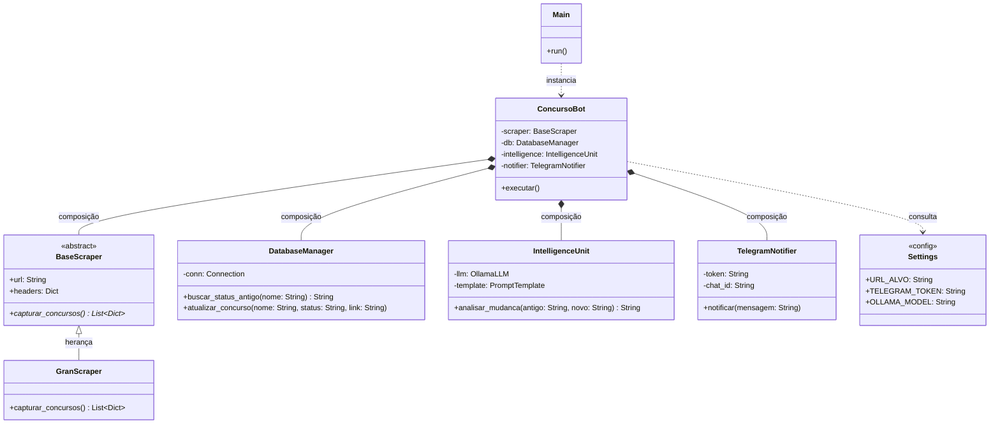

```mermaid
classDiagram
    class Main {
        +run()
    }

    class ConcursoBot {
        -scraper: BaseScraper
        -db: DatabaseManager
        -intelligence: IntelligenceUnit
        -notifier: TelegramNotifier
        +executar()
    }

    class BaseScraper {
        <<abstract>>
        +url: String
        +headers: Dict
        +capturar_concursos()* List~Dict~
    }

    class GranScraper {
        +capturar_concursos() List~Dict~
    }

    class DatabaseManager {
        -conn: Connection
        +buscar_status_antigo(nome: String) String
        +atualizar_concurso(nome: String, status: String, link: String)
    }

    class IntelligenceUnit {
        -llm: OllamaLLM
        -template: PromptTemplate
        +analisar_mudanca(antigo: String, novo: String) String
    }

    class TelegramNotifier {
        -token: String
        -chat_id: String
        +notificar(mensagem: String)
    }

    class Settings {
        <<config>>
        +URL_ALVO: String
        +TELEGRAM_TOKEN: String
        +OLLAMA_MODEL: String
    }

    Main ..> ConcursoBot : instancia
    ConcursoBot *-- BaseScraper : composição
    ConcursoBot *-- DatabaseManager : composição
    ConcursoBot *-- IntelligenceUnit : composição
    ConcursoBot *-- TelegramNotifier : composição
    BaseScraper <|-- GranScraper : herança
    ConcursoBot ..> Settings : consulta
```