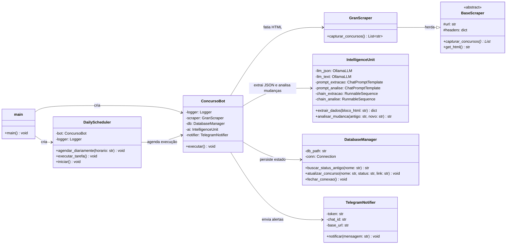

```mermaid
classDiagram
    direction LR

    class main {
        +main() void
    }

    class ConcursoBot {
        -logger: Logger
        -scraper: GranScraper
        -db: DatabaseManager
        -ai: IntelligenceUnit
        -notifier: TelegramNotifier
        +executar() void
    }

    class BaseScraper {
        <<abstract>>
        #url: str
        #headers: dict
        +capturar_concursos()* List
        +get_html() str
    }

    class GranScraper {
        +capturar_concursos() List~str~
    }

    class IntelligenceUnit {
        -llm_json: OllamaLLM
        -llm_text: OllamaLLM
        -prompt_extracao: ChatPromptTemplate
        -prompt_analise: ChatPromptTemplate
        -chain_extracao: RunnableSequence
        -chain_analise: RunnableSequence
        +extrair_dados(bloco_html: str) dict
        +analisar_mudanca(antigo: str, novo: str) str
    }

    class DatabaseManager {
        -db_path: str
        -conn: Connection
        +buscar_status_antigo(nome: str) str
        +atualizar_concurso(nome: str, status: str, link: str) void
        +fechar_conexao() void
    }

    class TelegramNotifier {
        -token: str
        -chat_id: str
        -base_url: str
        +notificar(mensagem: str) void
    }

    class DailyScheduler {
        -bot: ConcursoBot
        -logger: Logger
        +agendar_diariamente(horario: str) void
        +executar_tarefa() void
        +iniciar() void
    }

    main --> ConcursoBot : cria
    main --> DailyScheduler : cria
    DailyScheduler --> ConcursoBot : agenda execução
    ConcursoBot --> GranScraper : fatia HTML
    ConcursoBot --> IntelligenceUnit : extrai JSON e analisa mudanças
    ConcursoBot --> DatabaseManager : persiste estado
    ConcursoBot --> TelegramNotifier : envia alertas
    GranScraper --|> BaseScraper : herda
```