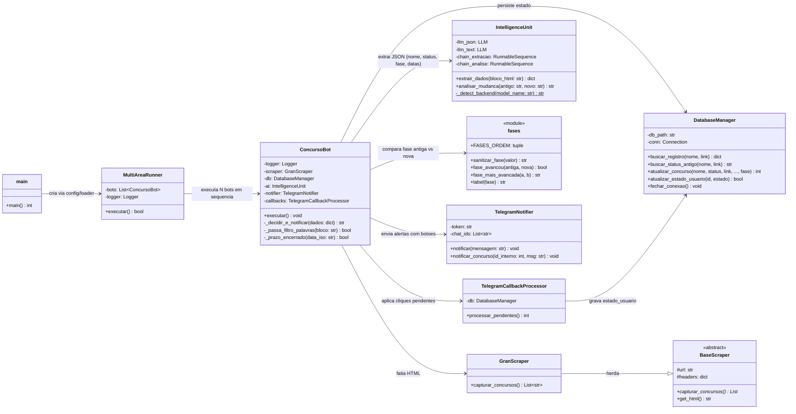

```mermaid
classDiagram
    direction LR

    class main {
        +main() int
    }

    class MultiAreaRunner {
        -bots: List~ConcursoBot~
        -logger: Logger
        +executar() bool
    }

    class ConcursoBot {
        -logger: Logger
        -scraper: GranScraper
        -db: DatabaseManager
        -ai: IntelligenceUnit
        -notifier: TelegramNotifier
        -callbacks: TelegramCallbackProcessor
        +executar() void
        -_decidir_e_notificar(dados: dict) str
        -_passa_filtro_palavras(bloco: str) bool
        -_prazo_encerrado(data_iso: str) bool
    }

    class BaseScraper {
        <<abstract>>
        #url: str
        #headers: dict
        +capturar_concursos()* List
        +get_html() str
    }

    class GranScraper {
        +capturar_concursos() List~str~
    }

    class IntelligenceUnit {
        -llm_json: LLM
        -llm_text: LLM
        -chain_extracao: RunnableSequence
        -chain_analise: RunnableSequence
        +extrair_dados(bloco_html: str) dict
        +analisar_mudanca(antigo: str, novo: str) str
        -_detect_backend(model_name: str)$ str
    }

    class fases {
        <<module>>
        +FASES_ORDEM: tuple
        +sanitizar_fase(valor) str
        +fase_avancou(antiga, nova) bool
        +fase_mais_avancada(a, b) str
        +label(fase) str
    }

    class DatabaseManager {
        -db_path: str
        -conn: Connection
        +buscar_registro(nome, link) dict
        +buscar_status_antigo(nome, link) str
        +atualizar_concurso(nome, status, link, ..., fase) int
        +atualizar_estado_usuario(id, estado) bool
        +fechar_conexao() void
    }

    class TelegramNotifier {
        -token: str
        -chat_ids: List~str~
        +notificar(mensagem: str) void
        +notificar_concurso(id_interno: int, msg: str) void
    }

    class TelegramCallbackProcessor {
        -db: DatabaseManager
        +processar_pendentes() int
    }

    main --> MultiAreaRunner : cria via config/loader
    MultiAreaRunner --> ConcursoBot : executa N bots em sequencia
    ConcursoBot --> TelegramCallbackProcessor : aplica cliques pendentes
    ConcursoBot --> GranScraper : fatia HTML
    ConcursoBot --> IntelligenceUnit : extrai JSON (nome, status, fase, datas)
    ConcursoBot --> fases : compara fase antiga vs nova
    ConcursoBot --> DatabaseManager : persiste estado
    ConcursoBot --> TelegramNotifier : envia alertas com botoes
    TelegramCallbackProcessor --> DatabaseManager : grava estado_usuario
    GranScraper --|> BaseScraper : herda
```

> O agendamento é externo (Windows Task Scheduler ou cron no Linux). `src/scheduler/runner.py` (`DailyScheduler`) é legado e não é mais usado pelo `main.py`.
