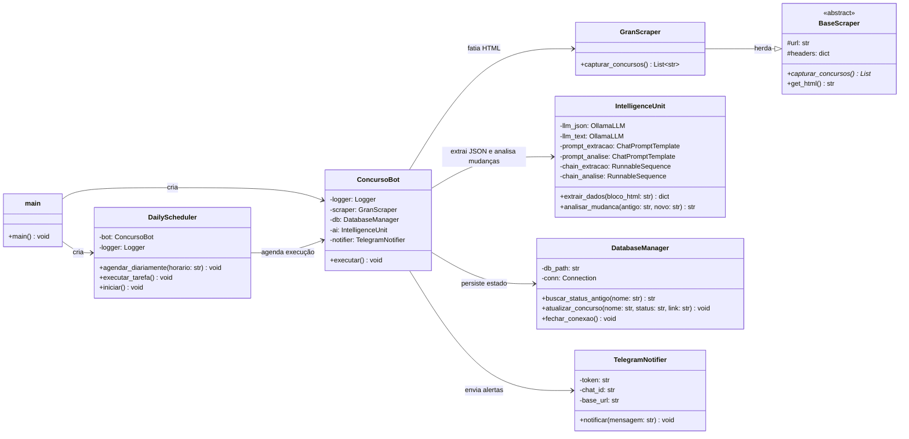

# 🏠 Monitor de Concursos TI — AI-First Web Scraping

Sistema automatizado para monitorar, analisar e notificar atualizações de **Concursos Públicos de TI** no Brasil. Utiliza uma arquitetura **AI-First**, onde uma LLM local (Llama 3.1 via Ollama) lê diretamente o HTML bruto da página, extrai dados estruturados e decide quais mudanças são relevantes — tudo sem depender de seletores CSS frágeis.

---

## 💡 Por que AI-First?

Na abordagem tradicional de Web Scraping, o código quebra toda vez que o site muda seu layout HTML (classes CSS renomeadas, tags reorganizadas, etc.). Neste projeto, o BeautifulSoup atua **apenas como fatiador** (Slicer): ele divide a página em blocos de HTML usando tags `<h3>` como delimitadores. Quem **interpreta** o conteúdo é a LLM local:

```
┌─────────────┐       ┌──────────────┐       ┌──────────────────┐
│  Página Web │──────▶│  Slicer (BS4) │──────▶│   LLM (Ollama)   │
│  (HTML)     │       │  Fatia em     │       │  Lê o HTML bruto │
│             │       │  blocos <h3>  │       │  e retorna JSON  │
└─────────────┘       └──────────────┘       └──────────────────┘
```

**Vantagem:** Se o site trocar classes, reorganizar divs ou mudar o layout, o sistema continua funcionando — a LLM entende o *significado* do HTML, não a sua estrutura exata.

---

## 🚀 Funcionalidades

| Funcionalidade | Descrição |
|---|---|
| **AI-First Extraction** | A LLM lê blocos de HTML bruto e extrai JSON estruturado (`nome`, `status`, `link`), filtrando automaticamente seções redundantes (listas genéricas, "Notícias Recomendadas", etc.). |
| **Análise Semântica de Mudanças** | Uma segunda chain de IA compara o status antigo com o novo e decide se a mudança é relevante (edital publicado, banca escolhida) ou irrelevante (reescrita, vírgula corrigida). |
| **Scraping Resiliente** | O BeautifulSoup atua apenas como fatiador de HTML, sem depender de seletores CSS específicos. |
| **Persistência (SQLite)** | Banco de dados local para controle de histórico e prevenção de duplicidade. |
| **Notificações Telegram** | Alertas formatados em HTML enviados automaticamente para um chat/bot do Telegram. |
| **Agendamento Automático** | Execução diária programada via `schedule`, com loop infinito em background. |
| **Logging Profissional** | Registros com rotação de arquivos (`RotatingFileHandler`) para monitoramento de saúde do bot. |

---

## 🏗️ Arquitetura — Fluxo de Dados

```
main.py
  │
  ▼
ConcursoBot (Orquestrador)
  │
  ├──▶ GranScraper.capturar_concursos()
  │       │  Faz GET na URL ──▶ Fatia HTML em blocos <h3>
  │       │  Retorna: List[str]  (blocos de HTML bruto)
  │       ▼
  ├──▶ IntelligenceUnit.extrair_dados(bloco_html)
  │       │  Chain de Extração: Prompt + OllamaLLM (JSON mode) + Parser
  │       │  Retorna: {"ignorar": bool, "nome": str, "status": str, "link": str}
  │       ▼
  ├──▶ DatabaseManager.buscar_status_antigo(nome)
  │       │  Consulta SQLite ──▶ Retorna status anterior ou None
  │       ▼
  ├──▶ IntelligenceUnit.analisar_mudanca(antigo, novo)
  │       │  Chain de Análise: Prompt + OllamaLLM (text mode) + Parser
  │       │  Retorna: resumo da mudança ou None (se irrelevante)
  │       ▼
  └──▶ TelegramNotifier.notificar(mensagem)
          Envia alerta formatado via API do Telegram
```

---

## 📐 Diagrama de Classes (Mermaid)



---

## 📂 Estrutura do Projeto

```
monitor_concursos_ti/
├── main.py                     # Ponto de entrada (carrega .env, cria bot e scheduler)
├── requirements.txt            # Dependências do projeto
├── .env                        # Variáveis sensíveis (Tokens, IDs, modelo)
├── config/
│   └── settings.py             # Configurações auxiliares
├── data/
│   └── concursos.db            # Banco SQLite (gerado automaticamente)
├── logs/
│   └── bot_concursos.log       # Logs com rotação (gerado automaticamente)
└── src/
    ├── __init__.py
    ├── core/
    │   ├── __init__.py
    │   └── bot.py              # ConcursoBot — Orquestrador principal
    ├── scrapers/
    │   ├── __init__.py
    │   ├── base_scraper.py     # BaseScraper — Classe abstrata (ABC)
    │   └── gran_scraper.py     # GranScraper — Fatiador de HTML (Slicer)
    ├── intelligence/
    │   ├── __init__.py
    │   └── langchain_unit.py   # IntelligenceUnit — Cérebro duplo (Extração + Análise)
    ├── database/
    │   ├── __init__.py
    │   └── manager.py          # DatabaseManager — Persistência SQLite
    ├── notifiers/
    │   ├── __init__.py
    │   └── telegram.py         # TelegramNotifier — Alertas via Telegram
    ├── scheduler/
    │   ├── __init__.py
    │   └── runner.py           # DailyScheduler — Agendamento diário
    └── utils/
        ├── __init__.py
        └── logger.py           # setup_logger() — Logging com RotatingFileHandler
```

---

## 📖 Descrição dos Módulos

| Módulo | Responsabilidade |
|---|---|
| `main.py` | Carrega variáveis de ambiente, instancia o `ConcursoBot` e o `DailyScheduler`, e inicia o loop de monitoramento. |
| `src/core/bot.py` | **Orquestrador.** Recebe blocos HTML do scraper, envia para a IA extrair JSON, consulta o banco, chama a IA de análise e dispara notificações. |
| `src/scrapers/` | Fatiamento do HTML. O `GranScraper` usa `<h3>` como delimitador para recortar a página em blocos independentes. |
| `src/intelligence/` | **Cérebro duplo.** Chain de Extração (HTML → JSON) e Chain de Análise (status antigo vs. novo → veredicto de relevância). |
| `src/database/` | Persistência SQLite. Armazena nome, status, link e timestamp de cada concurso para controle de histórico. |
| `src/notifiers/` | Integração de saída. Envia mensagens formatadas em HTML para o Telegram via API REST. |
| `src/scheduler/` | Agendamento com `schedule`. Executa o bot diariamente no horário configurado no `.env`. |
| `src/utils/` | Logger com rotação de arquivos (1 MB por arquivo, até 5 backups). |
| `config/` | Centraliza parâmetros para evitar *magic strings* espalhadas pelo código. |

---

## 🛠️ Instalação e Configuração

### 1. Pré-requisitos

* **Python 3.10+**
* **Ollama** instalado e rodando localmente
* Modelo de IA baixado:
  ```bash
  ollama pull llama3.1
  ```

### 2. Configurar o Ambiente

```bash
# Clone o repositório
git clone <url-do-repositorio>
cd monitor_concursos_ti

# Crie e ative o ambiente virtual
python -m venv .venv
# Windows (Git Bash):
source .venv/Scripts/activate
# Linux/Mac:
source .venv/bin/activate

# Instale as dependências
pip install -r requirements.txt
```

### 3. Variáveis de Ambiente

Crie um arquivo `.env` na raiz do projeto:

```env
TELEGRAM_TOKEN=seu_token_aqui
TELEGRAM_CHAT_ID=seu_chat_id_aqui
OLLAMA_MODEL=llama3.1
URL_ALVO=https://blog.grancursosonline.com.br/concursos-ti/
HORARIO_EXECUCAO=08:30
```

---

## ▶️ Como Executar

```bash
python main.py
```

O bot irá:
1. Executar uma varredura imediata ao iniciar.
2. Entrar em loop infinito, repetindo a varredura diariamente no horário configurado.

### Monitoramento

* **Logs:** pasta `logs/` — histórico de decisões da IA, erros e ciclos de execução.
* **Banco de Dados:** pasta `data/` — visualize os editais salvos com qualquer leitor SQLite.

---

## 🧪 Stack Tecnológica

| Tecnologia | Uso |
|---|---|
| Python 3.10+ | Linguagem principal |
| BeautifulSoup 4 | Fatiamento de HTML (Slicer) |
| LangChain | Framework de orquestração de prompts e chains |
| Ollama (Llama 3.1) | LLM local para extração e análise semântica |
| SQLite | Persistência leve e sem servidor |
| Telegram Bot API | Canal de notificações |
| schedule | Agendamento de tarefas diárias |
| python-dotenv | Carregamento de variáveis de ambiente |

---

**Desenvolvido como um projeto de automação e estudo de Python / IA.**


