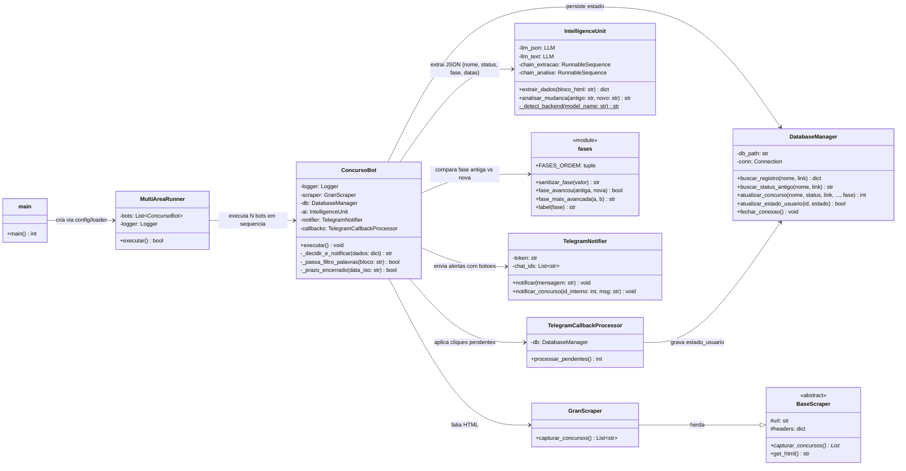

# 🏠 Monitor de Concursos (TI + Multi-Area) — AI-First Web Scraping

Sistema automatizado para monitorar, analisar e notificar atualizações de concursos em diferentes áreas. A versão atual suporta monitoramento multi-area com roteamento de mensagens por chat do Telegram (ex.: TI para você, Educação para sua namorada).

Utiliza uma arquitetura **AI-First**, onde uma LLM (Ollama local, API remota ou Claude Code CLI) lê blocos de HTML, extrai dados estruturados e classifica a fase de cada concurso.

## Novidades desta versao

- **Detecção de mudança por fase estruturada** (schema v4): a LLM classifica cada concurso num vocabulário fechado (`previsto → banca_definida → edital_publicado → inscricoes_abertas → inscricoes_encerradas → concluido`). Só avanço de fase ou mudança de prazo notifica — reescrita de texto e regressão de fase (flapping da LLM) são silenciosas. Mata os falsos positivos de "ATUALIZAÇÃO IMPORTANTE".
- **Filtro de listagem morta**: concurso sem inscrição ativa cujo último evento citado já passou (ex.: "provas previstas para maio de 2025") é salvo em silêncio, não notificado como novo. "Previstos" legítimos (sem data alguma) continuam notificando.
- **Alerta de varredura cega**: pagina sem nenhum bloco (site fora do ar / layout mudou) envia ⚠️ em vez do falso "nada novo". Em alvos **filtrados** por `keywords_include` (ex.: nicho numa pagina generica), "0 concursos da area" e dia quieto normal e vira heartbeat.
- **Botões interativos no Telegram**: ⭐ Seguir (notifica para sempre) / ❌ Não tenho interesse (silencia o concurso).
- **Modo single-run**: `main.py` executa uma varredura e encerra. Agendamento diario pelo SO — Windows Task Scheduler (`scripts/install_schedule.ps1`) ou cron no Linux (`scripts/install_schedule.sh`).
- **Tres backends de LLM** selecionaveis via `LLM_MODEL`: Ollama local, API remota (LiteLLM), ou Claude Code CLI (usa assinatura local, custo zero).
- **Bateria de testes**: 149 testes unitarios e de integracao com pytest (`pip install -r requirements-dev.txt && pytest`).
- Execucao multi-area no mesmo ciclo via `MONITOR_TARGETS_JSON`.
- Roteamento de notificacoes para um ou mais `chat_id` por area.
- Filtragem area-aware com palavras-chave de inclusao/exclusao (pre-filtro textual + reforco no prompt da IA).
- Suporte a paginas de blog do Gran (`concursos-ti/`, `concursos-educacao/`, `concursos-abertos/`). As paginas de carreira (`/cursos/carreira/*`) viraram JS-rendered em jun/2026 e nao sao mais scrapeaveis — para nichos, use alvo filtrado por `keywords_include` na pagina generica `concursos-abertos/`.
- Dedup por link canonico (prompt forca o link mais curto do blog) + chave composta `(area, nome)` case-insensitive no SQLite.

---

## 💡 Por que AI-First?

Na abordagem tradicional de Web Scraping, o código quebra toda vez que o site muda seu layout HTML (classes CSS renomeadas, tags reorganizadas, etc.). Neste projeto, o BeautifulSoup atua **apenas como fatiador** (Slicer): ele divide a página em blocos de HTML usando tags `<h3>` como delimitadores. Quem **interpreta** o conteúdo é a LLM:

```
┌─────────────┐       ┌──────────────┐       ┌──────────────────┐
│  Página Web │──────▶│  Slicer (BS4) │──────▶│       LLM        │
│  (HTML)     │       │  Fatia em     │       │  Lê o HTML bruto │
│             │       │  blocos <h3>  │       │  e retorna JSON  │
└─────────────┘       └──────────────┘       └──────────────────┘
```

**Vantagem:** Se o site trocar classes, reorganizar divs ou mudar o layout, o sistema continua funcionando — a LLM entende o *significado* do HTML, não a sua estrutura exata.

---

## 🚀 Funcionalidades

| Funcionalidade | Descrição |
|---|---|
| **AI-First Extraction** | A LLM lê blocos de HTML bruto e extrai JSON estruturado (`nome`, `status`, `link`, `data_fim_inscricao`, `data_referencia`, `fase`), filtrando automaticamente seções redundantes (listas genéricas, "Notícias Recomendadas", etc.). |
| **Detecção por fase estruturada** | A mudança é detectada comparando a `fase` (vocabulário fechado de 6 estágios) e o prazo de inscrição — não o texto livre, que a LLM reformula a cada varredura. Só avanço de fase ou mudança de data notifica. |
| **Filtro de listagem morta** | Concursos antigos que continuam na página (sem inscrição ativa e com último evento no passado) são salvos em silêncio. |
| **Botões interativos** | Cada notificação traz ⭐ Seguir / ❌ Não tenho interesse; o estado controla as notificações futuras daquele concurso. |
| **Scraping Resiliente** | O BeautifulSoup atua apenas como fatiador de HTML, sem depender de seletores CSS específicos. Página que não entrega nenhum bloco dispara alerta ⚠️ em vez de falso "nada novo". |
| **Persistência (SQLite)** | Banco local (schema v4) com dedup por link canônico, fallback por nome case-insensitive e migrações automáticas. |
| **Notificações Telegram** | Alertas formatados em HTML, roteados por área para um ou mais chats. |
| **Agendamento Automático** | Execução diária via Windows Task Scheduler (`scripts/install_schedule.ps1`, com catch-up) ou cron no Linux (`scripts/install_schedule.sh`, sem catch-up). |
| **Logging Profissional** | Registros com rotação de arquivos (`RotatingFileHandler`) para monitoramento de saúde do bot. |

---

## 🏗️ Arquitetura — Fluxo de Dados

```
main.py
  │
  ▼
MultiAreaRunner ──▶ executa N bots em sequencia
  │
  ▼
ConcursoBot (Orquestrador, um por area)
  │
  ├──▶ TelegramCallbackProcessor.processar_pendentes()
  │       │  Aplica cliques pendentes (⭐/❌) no banco antes da varredura
  │       ▼
  ├──▶ GranScraper.capturar_concursos()
  │       │  Faz GET na URL ──▶ Fatia HTML em blocos <h3>
  │       │  Retorna: List[str]  (blocos de HTML bruto)
  │       ▼
  ├──▶ IntelligenceUnit.extrair_dados(bloco_html)
  │       │  Chain de Extração: Prompt + LLM (JSON mode) + Parser
  │       │  Retorna: {"ignorar", "nome", "status", "link",
  │       │            "data_fim_inscricao", "data_referencia", "fase"}
  │       ▼
  ├──▶ DatabaseManager.buscar_registro(nome, link)
  │       │  Consulta SQLite ──▶ registro anterior (fase, data, estado) ou None
  │       ▼
  ├──▶ ConcursoBot._decidir_e_notificar(dados)
  │       │  Matriz de decisão SEM LLM: compara fase antiga vs nova e
  │       │  data_fim_inscricao. Avanço de fase ou data nova ──▶ notifica.
  │       │  Reescrita, regressão de fase, listagem morta ──▶ silêncio.
  │       ▼
  └──▶ TelegramNotifier.notificar_concurso(id, mensagem)
          Envia alerta com botões ⭐/❌ via API do Telegram
```

---

## 📐 Diagrama de Classes (Mermaid)


```mermaid
classDiagram
    direction LR

    class main {
        +main() int
    }

    class MultiAreaRunner {
        -bots: List~ConcursoBot~
        -logger: Logger
        +executar() bool
    }

    class ConcursoBot {
        -logger: Logger
        -scraper: GranScraper
        -db: DatabaseManager
        -ai: IntelligenceUnit
        -notifier: TelegramNotifier
        -callbacks: TelegramCallbackProcessor
        +executar() void
        -_decidir_e_notificar(dados: dict) str
        -_passa_filtro_palavras(bloco: str) bool
        -_prazo_encerrado(data_iso: str) bool
    }

    class BaseScraper {
        <<abstract>>
        #url: str
        #headers: dict
        +capturar_concursos()* List
        +get_html() str
    }

    class GranScraper {
        +capturar_concursos() List~str~
    }

    class IntelligenceUnit {
        -llm_json: LLM
        -llm_text: LLM
        -chain_extracao: RunnableSequence
        -chain_analise: RunnableSequence
        +extrair_dados(bloco_html: str) dict
        +analisar_mudanca(antigo: str, novo: str) str
        -_detect_backend(model_name: str)$ str
    }

    class fases {
        <<module>>
        +FASES_ORDEM: tuple
        +sanitizar_fase(valor) str
        +fase_avancou(antiga, nova) bool
        +fase_mais_avancada(a, b) str
        +label(fase) str
    }

    class DatabaseManager {
        -db_path: str
        -conn: Connection
        +buscar_registro(nome, link) dict
        +buscar_status_antigo(nome, link) str
        +atualizar_concurso(nome, status, link, ..., fase) int
        +atualizar_estado_usuario(id, estado) bool
        +fechar_conexao() void
    }

    class TelegramNotifier {
        -token: str
        -chat_ids: List~str~
        +notificar(mensagem: str) void
        +notificar_concurso(id_interno: int, msg: str) void
    }

    class TelegramCallbackProcessor {
        -db: DatabaseManager
        +processar_pendentes() int
    }

    main --> MultiAreaRunner : cria via config/loader
    MultiAreaRunner --> ConcursoBot : executa N bots em sequencia
    ConcursoBot --> TelegramCallbackProcessor : aplica cliques pendentes
    ConcursoBot --> GranScraper : fatia HTML
    ConcursoBot --> IntelligenceUnit : extrai JSON (nome, status, fase, datas)
    ConcursoBot --> fases : compara fase antiga vs nova
    ConcursoBot --> DatabaseManager : persiste estado
    ConcursoBot --> TelegramNotifier : envia alertas com botoes
    TelegramCallbackProcessor --> DatabaseManager : grava estado_usuario
    GranScraper --|> BaseScraper : herda
```

> O agendamento é externo (Task Scheduler/cron). `src/scheduler/runner.py` (`DailyScheduler`) é legado e não é mais usado pelo `main.py`.

---

## 📂 Estrutura do Projeto

```
monitor_concursos_ti/
├── main.py                     # Ponto de entrada (carrega .env, cria bot e scheduler)
├── requirements.txt            # Dependências do projeto
├── .env                        # Variáveis sensíveis (Tokens, IDs, modelo)
├── config/
│   ├── loader.py               # Carregador multi-area / legado
│   └── settings.py             # Configurações auxiliares
├── data/
│   └── concursos.db            # Banco SQLite (gerado automaticamente)
├── logs/
│   └── bot_concursos.log       # Logs com rotação (gerado automaticamente)
├── scripts/
│   ├── install_schedule.ps1    # Agendamento diário no Windows (Task Scheduler)
│   ├── run_daily.bat           # Wrapper chamado pela tarefa do Windows
│   ├── install_schedule.sh     # Agendamento diário no Linux (cron)
│   ├── run_daily.sh            # Wrapper chamado pelo cron (1 run/dia + catch-up)
│   └── dedupe_db.py            # Limpeza one-off de duplicatas no banco
└── src/
    ├── __init__.py
    ├── core/
    │   ├── __init__.py
    │   ├── bot.py              # ConcursoBot — Orquestrador + matriz de decisão por fase
    │   └── multi_area_runner.py # MultiAreaRunner — Executor multi-area
    ├── scrapers/
    │   ├── __init__.py
    │   ├── base_scraper.py     # BaseScraper — Classe abstrata (ABC)
    │   └── gran_scraper.py     # GranScraper — Fatiador de HTML (Slicer)
    ├── intelligence/
    │   ├── __init__.py
    │   ├── langchain_unit.py   # IntelligenceUnit — Chain de extração (HTML → JSON)
    │   └── claude_cli_backend.py # ClaudeCliLLM — backend via Claude Code CLI
    ├── database/
    │   ├── __init__.py
    │   └── manager.py          # DatabaseManager — Persistência SQLite (schema v4)
    ├── notifiers/
    │   ├── __init__.py
    │   ├── telegram.py         # TelegramNotifier — Alertas com botões inline
    │   └── telegram_callbacks.py # TelegramCallbackProcessor — aplica cliques ⭐/❌
    ├── scheduler/
    │   ├── __init__.py
    │   └── runner.py           # DailyScheduler — LEGADO (agendamento agora é externo)
    └── utils/
        ├── __init__.py
        ├── fases.py            # Vocabulário controlado de fases do concurso
        ├── text.py             # status_fingerprint() — hash normalizado de status
        └── logger.py           # setup_logger() — Logging com RotatingFileHandler
```

---

## 📖 Descrição dos Módulos

| Módulo | Responsabilidade |
|---|---|
| `main.py` | Carrega variáveis de ambiente, instancia os `ConcursoBot`s via `config/loader.py`, cria o `MultiAreaRunner` e executa **uma** varredura (exit 0/1). |
| `src/core/bot.py` | **Orquestrador por area.** Processa cliques pendentes, recebe blocos HTML do scraper, envia para a IA extrair JSON e aplica a matriz de decisão por fase (sem segunda chamada de LLM). |
| `src/core/multi_area_runner.py` | Executa uma lista de `ConcursoBot`s em sequência a cada ciclo. |
| `src/scrapers/` | Fatiamento do HTML. O `GranScraper` usa `<h3>` como delimitador para recortar a página em blocos independentes. |
| `src/intelligence/` | Chain de Extração (HTML → JSON com `nome`, `status`, `link`, datas e `fase`) sobre um dos três backends de LLM. A chain de análise (`analisar_mudanca`) existe mas saiu do fluxo de decisão. |
| `src/database/` | Persistência SQLite (schema v4). Armazena nome, status, link, datas, fase e estado do usuário; dedup por link canônico; migrações automáticas. |
| `src/notifiers/` | Integração de saída. `telegram.py` envia mensagens com botões inline; `telegram_callbacks.py` aplica os cliques (⭐/❌) no banco no início de cada run. |
| `src/scheduler/` | **Legado.** `DailyScheduler` ainda existe mas nao e mais usado por `main.py` — o agendamento agora e externo (Task Scheduler no Windows, cron no Linux). |
| `src/utils/` | `fases.py` (vocabulário de fases), `text.py` (fingerprint de status), `logger.py` (rotação de arquivos, 1 MB por arquivo, até 5 backups). |
| `config/loader.py` | Carrega alvos de `MONITOR_TARGETS_JSON` ou modo legado (`URL_ALVO`). |

---

## 🛠️ Instalação e Configuração

### 1. Pré-requisitos

* **Python 3.10+**
* Um backend de LLM (veja "Opcoes de LLM" abaixo). Ollama só é necessário se `LLM_MODEL` for um nome simples como `llama3.1`:
  ```bash
  ollama pull llama3.1
  ```

### 2. Configurar o Ambiente

```bash
# Clone o repositório
git clone <url-do-repositorio>
cd monitor_concursos_ti

# Crie e ative o ambiente virtual
python -m venv .venv
# Windows (Git Bash):
source .venv/Scripts/activate
# Linux/Mac:
source .venv/bin/activate

# Instale as dependências
pip install -r requirements.txt
```

### 3. Variaveis de Ambiente

Copie `.env.example` e ajuste para seu caso. Veja o proprio `.env.example` para a lista completa — abaixo estao apenas os blocos principais.

**IMPORTANTE:** `MONITOR_TARGETS_JSON` deve ficar em UMA unica linha no `.env`. O `python-dotenv` nao suporta valores multilinha — se voce formatar bonito vai quebrar silenciosamente e cair no modo legado.

Modo legado (single-area) continua disponivel com `URL_ALVO` e `TELEGRAM_CHAT_ID`.

---

## Opcoes de LLM

O backend e escolhido exclusivamente pelo formato de `LLM_MODEL`:

| `LLM_MODEL`                          | Backend         | Custo            | Latencia | Notas                                              |
| ------------------------------------ | --------------- | ---------------- | -------- | -------------------------------------------------- |
| `llama3.1`, `qwen2.5:7b`, etc        | Ollama local    | Zero             | Baixa    | Precisa do Ollama rodando; pesa no hardware local. |
| `anthropic/claude-haiku-4-5-...`     | LiteLLM (API)   | Por token        | Muito baixa | Requer `ANTHROPIC_API_KEY` (ou provider equivalente). |
| `claude-cli:haiku` (`sonnet`/`opus`) | Claude Code CLI | Zero (assinatura) | Alta    | Usa o `claude` autenticado na maquina. Indicado para agendamentos de baixa frequencia. |

**Regra de selecao** (em `src/intelligence/langchain_unit.py`):
- Se o nome comeca com `claude-cli` → Claude Code CLI
- Se contem `/` → LiteLLM
- Caso contrario → Ollama

Todos os tres compartilham `OLLAMA_TIMEOUT_S`, `OLLAMA_RETRIES` e `OLLAMA_RETRY_DELAY_S` (prefixo `OLLAMA_` e historico — aplica-se a qualquer backend).

---

## Como Executar

### Execucao manual (uma varredura)

```bash
python main.py
```

O bot executa uma varredura em todas as areas configuradas e encerra com exit code `0` (sucesso) ou `1` (erro). **Nao fica mais em loop** — o agendamento diario e feito pelo sistema operacional.

### Agendamento diario (Windows Task Scheduler)

O projeto inclui um script PowerShell que registra uma tarefa no Windows para rodar diariamente. Execute **uma vez** para instalar:

```powershell
# Rodar na raiz do projeto, em PowerShell normal (nao precisa admin):
.\scripts\install_schedule.ps1

# Para um horario diferente do padrao (03:00):
.\scripts\install_schedule.ps1 -Time 04:30

# Para inspecionar/testar/remover:
schtasks /query /tn MonitorConcursos /v /fo LIST
schtasks /run /tn MonitorConcursos
schtasks /delete /tn MonitorConcursos /f
```

A tarefa chama `scripts\run_daily.bat`, que:
1. Ativa o `.venv` local.
2. Roda `python main.py`.
3. Grava stdout/stderr em `logs\run_YYYYMMDD.log` (um arquivo por dia).

Configuracoes relevantes da tarefa:
- **LogonType Interactive**: roda como voce, sem senha — so dispara enquanto voce esta logado (apos reiniciar, basta logar 1x).
- **StartWhenAvailable**: se o PC estava desligado/dormindo as 03:00, roda assim que voltar a ficar disponivel (catch-up).
- **MultipleInstances=IgnoreNew**: se o run anterior ainda esta rodando, o novo trigger e ignorado (nao empilha).
- **ExecutionTimeLimit=1h**: mata o processo se passar de 1h.
- **DontStopIfGoingOnBatteries / AllowStartIfOnBatteries**: roda em qualquer condicao de energia.
- **RestartCount=2 / RestartInterval=5min**: se o run falhar, reinicia ate 2x com 5min entre tentativas.
- **RunLevel Limited**: sem elevacao de admin.

### Agendamento diario (Linux, cron)

```bash
# Instalar as 03:00 (idempotente; pode rodar de novo apos mover o repo):
./scripts/install_schedule.sh

# Outro horario:
./scripts/install_schedule.sh 04:30

# Inspecionar / remover:
crontab -l
./scripts/install_schedule.sh --remove
```

O cron chama `scripts/run_daily.sh` **uma vez por dia, de madrugada** (03:00 por padrao). Um marker de sucesso diario evita varredura duplicada se voce rodar manualmente no mesmo dia, um `flock` impede execucoes simultaneas e a saida vai para `logs/run_YYYYMMDD.log`.

> Diferente do Task Scheduler no Windows (`StartWhenAvailable`), o cron **nao tem catch-up**: se o computador estiver desligado/suspenso no horario, a varredura daquele dia nao acontece.

No modo multi-area, cada ciclo executa todos os alvos configurados e aplica deduplicacao por area no banco.

## Quando o bot notifica (matriz de decisao)

| Situacao | Acao |
|---|---|
| Concurso novo, ativo ou previsto | 🆕 NOVO CONCURSO (com fase e prazo) |
| Concurso novo, inscricao ja encerrada ou listagem morta | Salva em silencio |
| Fase avancou (ex.: banca definida → edital publicado) | 🔔 ATUALIZAÇÃO |
| Prazo de inscricao mudou | 🔔 ATUALIZAÇÃO |
| LLM so reescreveu o texto / regrediu a fase | Silencio (fase mais avancada preservada) |
| Concurso marcado ⭐ Seguir | Notifica toda transicao real, mesmo apos o prazo |
| Concurso marcado ❌ Não tenho interesse | Nunca mais notifica (nem atualiza) |
| Varredura sem nenhuma novidade | ✅ heartbeat "Varredura Concluída" |
| Alvo filtrado (`keywords_include`): nenhum bloco da area hoje | ✅ heartbeat "nenhuma é da sua área hoje" |
| Pagina sem nenhum bloco, ou 0 validos em alvo SEM filtro | ⚠️ alerta de possivel site fora do ar / layout novo |

## Migracao de banco

Ao iniciar, o sistema migra automaticamente schemas antigos ate o v4 (migracoes aditivas: v1 nome-PK → v2 `(area, nome)` → v3 `id` autoincrement + estado do usuario → v4 coluna `fase`).

- Dados antigos sao preservados; linhas v1 sao marcadas com area `TI`.
- Linhas sem `fase` recebem backfill silencioso na primeira varredura pos-upgrade.
- Recomendado: fazer backup de `data/concursos.db` antes da primeira execucao nesta versao.

### Monitoramento

* **Logs:** pasta `logs/` — histórico de decisões da IA, erros e ciclos de execução.
* **Banco de Dados:** pasta `data/` — visualize os editais salvos com qualquer leitor SQLite.

---

## Testes

O projeto usa `pytest` + `pytest-mock`. Todas as dependencias externas (HTTP, LLM, subprocess) sao mockadas — nenhum teste precisa de Ollama, API key ou rede.

```bash
# Instalar dependencias de desenvolvimento
pip install -r requirements-dev.txt

# Rodar a suite completa
pytest

# Apenas um arquivo
pytest tests/test_config_loader.py

# Um teste especifico
pytest tests/test_concurso_bot.py::TestExecutarFlow::test_new_concurso_triggers_notification_and_db_insert

# Com cobertura
pytest --cov=src --cov=config --cov-report=term-missing
```

Organizacao dos testes (`tests/`, 149 testes):

| Arquivo | Cobertura |
| --- | --- |
| `test_config_loader.py`    | Parse de `MONITOR_TARGETS_JSON`, fallback legado, normalizacao de keywords. |
| `test_database_manager.py` | Criacao de schema v4, migracoes v1→v4, isolamento por area, upsert, dedup por link. |
| `test_intelligence_unit.py` | Selecao de backend (Ollama/LiteLLM/Claude CLI), parser JSON, sanitizacao de datas/fase, retry/fallback. |
| `test_gran_scraper.py`     | Slicer padrao por `<h3>`, slicer de pagina de carreira, filtros de ruido. |
| `test_telegram_notifier.py` | Dedup de `chat_ids`, no-op sem token, resiliencia a erros HTTP, botoes inline. |
| `test_telegram_callbacks.py` | Polling de `getUpdates`, aplicacao de estado, persistencia de offset. |
| `test_concurso_bot.py`     | Integracao: matriz de decisao completa (novo/backfill/reescrita/regressao/avanco de fase/listagem morta/alerta de varredura cega). |
| `test_claude_cli_backend.py` | Montagem do comando, stdin, timeout, parsing de alias, tratamento de erros. |
| `test_text_utils.py`       | `status_fingerprint`: normalizacao de acentos, espacos e pontuacao. |

---

## 🧪 Stack Tecnológica

| Tecnologia | Uso |
|---|---|
| Python 3.10+ | Linguagem principal |
| BeautifulSoup 4 | Fatiamento de HTML (Slicer) |
| LangChain | Framework de orquestração de prompts e chains |
| Ollama / LiteLLM / Claude Code CLI | Backends de LLM para extração semântica (escolhido por `LLM_MODEL`) |
| SQLite | Persistência leve e sem servidor (schema v4) |
| Telegram Bot API | Notificações com botões inline + callbacks |
| Task Scheduler / cron | Agendamento diário externo (Windows / Linux) |
| python-dotenv | Carregamento de variáveis de ambiente |
| pytest + pytest-mock | Suíte de 149 testes sem dependências externas |

---

**Desenvolvido como um projeto de automação e estudo de Python / IA.**


